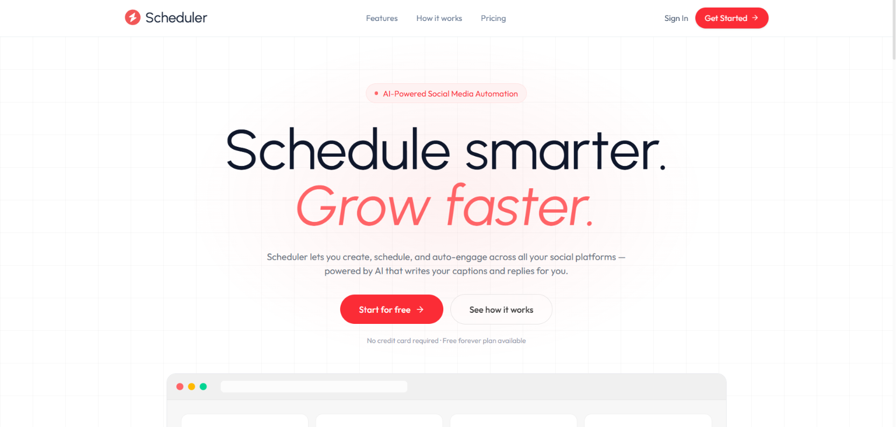
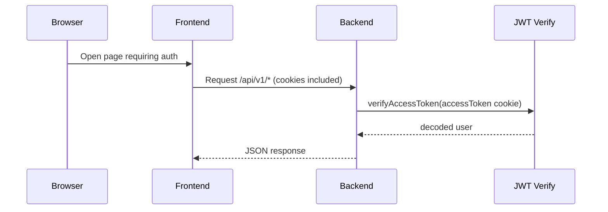
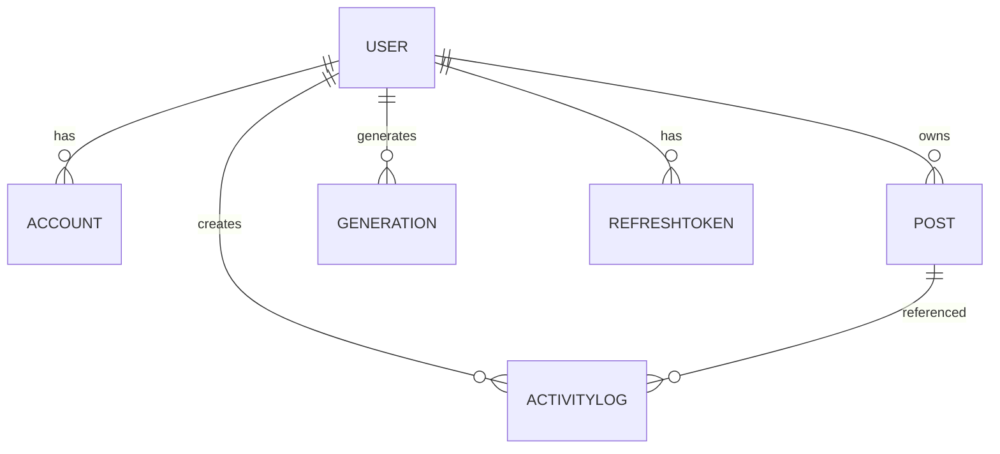

# Scheduler

> AI-assisted social content generator + multi-platform account sync + timed publishing.

## Overview
Scheduler is a full-stack TypeScript application that helps users:

- Create social media content with AI (text + optional image generation).
- Connect social accounts through an OAuth flow (via Zernio).
- Schedule posts for future publishing.
- View activity and post/generation history.

### Problem it solves
Publishing social content often involves multiple disconnected steps:
1) drafting posts,
2) generating variants,
3) connecting social platforms,
4) composing media,
5) scheduling content reliably.

This project unifies those steps behind a single authenticated workflow and automates publishing using a backend scheduler.

### Target users
- Solo creators and small teams who want to schedule posts across multiple social platforms.
- Marketers who want repeatable content generation + scheduling.

### Key value proposition
- **End-to-end workflow**: AI generation → scheduling → automated publishing.
- **Multi-platform support**: connect supported platforms and schedule per-account publish payloads.
- **Operational visibility**: dashboard shows scheduled/published counts and recent activity.

## Screenshots / Demo

Landing page:



### Mobile responsiveness

The UI is built with TailwindCSS (responsive utility classes like `md:grid-cols-*`, `flex-col lg:flex-row`, etc.).

### Admin panel
No dedicated admin panel exists in the codebase. Account connectivity and scheduling are user-scoped.

## Features

### Authentication
- User registration and login.
- Access token + refresh token rotation using HTTP-only cookies.
- Automatic refresh on the frontend when the API returns `401` (axios interceptor).

### User / Profile Management
- Users have: `name`, `email`, `password`, and `zernioProfileId`.
- User data is stored in MongoDB.

### Social Accounts
- Connect accounts per platform (supported: `twitter`, `facebook`, `instagram`, `linkedin`).
- Sync connected accounts from Zernio into local MongoDB documents.
- Disconnect an account (removes local document and attempts deletion in Zernio).

### AI / Generations
- Generate post content using Google Gemini.
- Optional image generation using Gemini image model.
- Persist generation history in MongoDB.

### Dashboard
- Fetch posts, connected accounts, and recent activity.
- Shows counts for scheduled posts, published posts, and connected accounts.

### Scheduling & Publishing
- Schedule posts for future publication across selected platforms.
- Backend runs a cron-based scheduler (every minute) to publish due posts.
- Scheduler updates post status: `scheduled` → `published` / `failed`.

### API Features
- REST API under `/api/v1/*`.
- Multipart scheduling with optional media (`multer` + `upload.single('media')`).

### Security Features
- HTTP-only cookies for tokens.
- JWT verification middleware (`requireAccessToken`).
- Refresh token hashing + storage with rotation and revocation tracking.

### Performance Features
- Frontend removes polling loops and fetches dashboard/posts on mount or after actions.
- Backend limits dashboard activity to the last 10 entries.

## Tech Stack

| Category | Technology |
|---|---|
| Frontend | React (TypeScript), Vite, React Router |
| Styling | TailwindCSS (via `@tailwindcss/vite`) |
| Backend | Express (TypeScript), MongoDB via Mongoose |
| Database | MongoDB |
| AI Providers | Google Gemini (`@google/genai`) and Zernio (`@zernio/node`) |
| Auth | JWT access + refresh tokens (cookies), bcrypt password hashing |
| HTTP / Cookies | `cors`, `cookie-parser` |
| Scheduling / Automation | `node-cron` (cron jobs in backend services) |
| File / Media | `multer` (multipart parsing) + filesystem writes to `backend/public/generated` |
| State Management (Client) | React Context (`AuthContext`) |
| API Client | Axios with response interceptor for refresh flow |
| DevOps / Deployment | Frontend includes `frontend/vercel.json` rewrites |
| Monitoring | Basic console logging and error responses |
| Testing | No test suite detected in codebase |

## System Architecture

### High-level architecture
```mermaid
flowchart LR
  U[User (Browser)] -->|HTTPS| FE[Frontend (React/Vite)]
  FE -->|API requests (cookies)| BE[Backend API (Express)]
  BE --> Mongo[(MongoDB)]
  BE --> Zernio[Zernio API]
  BE --> Gemini[Google Gemini API]
  BE --> SCHED[Scheduler (node-cron)]
  SCHED --> BE
  SCHED --> Zernio
  BE --> Files[Static media: backend/public/generated]
```

### Request lifecycle (authenticated)


### Scheduled publishing data flow
```mermaid
flowchart TD
  U[User schedules post] --> FE[POST /api/v1/posts/schedule]
  FE --> BE[Controller: schedulePost]
  BE --> Mongo[Create Post(status=scheduled)]

  BE --> Zernio[createPost(payload) in schedule payload]
  BE --> Cron[Cron: every minute]
  Cron --> Mongo[Find posts due: scheduledFor <= now AND status=scheduled]

  Cron --> Zernio[Publish publishNow=true payload]
  Cron --> Mongo[Update status: published/failed]
  Cron --> Mongo[Write ActivityLog]
```

## Folder Structure

### Repository root
```text
Scheduler/
├─ backend/
│  ├─ src/
│  │  ├─ server.ts
│  │  ├─ config/
│  │  │  ├─ config.ts
│  │  │  ├─ db.config.ts
│  │  │  └─ zernio.config.ts
│  │  ├─ routes/
│  │  │  ├─ auth.routes.ts
│  │  │  ├─ socialAuth.route.ts
│  │  │  ├─ account.route.ts
│  │  │  ├─ post.route.ts
│  │  │  └─ activityLog.route.ts
│  │  ├─ controllers/
│  │  │  ├─ auth.controller.ts
│  │  │  ├─ socialAuth.controller.ts
│  │  │  ├─ account.controller.ts
│  │  │  └─ post.controller.ts
│  │  │  └─ activityLog.controller.ts
│  │  ├─ middlewares/
│  │  │  └─ auth.middleware.ts
│  │  ├─ models/
│  │  │  ├─ user.model.ts
│  │  │  ├─ account.model.ts
│  │  │  ├─ post.model.ts
│  │  │  ├─ activitylog.model.ts
│  │  │  ├─ RefreshToken.model.ts
│  │  │  └─ generation.model.ts
│  │  ├─ services/
│  │  │  ├─ auth.service.ts
│  │  │  ├─ scheduler.service.ts
│  │  │  └─ keepAlive.service.ts
│  │  ├─ util/
│  │  │  └─ token.util.ts
│  └─ public/
│     └─ generated/ (created at runtime)
├─ frontend/
│  ├─ src/
│  │  ├─ api/
│  │  │  ├─ axios.ts
│  │  │  └─ config.ts
│  │  ├─ components/
│  │  │  ├─ Home/*
│  │  │  ├─ Sidebar.tsx
│  │  │  └─ (others)
│  │  ├─ context/
│  │  │  └─ AuthContext.tsx (+ useAuth.ts)
│  │  ├─ pages/
│  │  │  ├─ Home.tsx
│  │  │  ├─ Login.tsx
│  │  │  ├─ Accounts.tsx
│  │  │  ├─ AIComposer.tsx
│  │  │  ├─ Scheduler.tsx
│  │  │  └─ Dashboard.tsx
│  │  └─ assets/
│  │     └─ assets.tsx (+ images)
│  └─ public/
└─ README.md (this file)
```

### Important backend entry points
- `backend/src/server.ts`: Express app, middleware, route registration, cron initialization, and error handling.
- `backend/src/services/scheduler.service.ts`: minute-level cron job to publish due posts via Zernio.
- `backend/src/controllers/*`: route handlers (auth, social account sync, AI generation, scheduling).

### Important frontend entry points
- `frontend/src/context/AuthContext.tsx`: stores user state and refresh flow triggers.
- `frontend/src/api/axios.ts`: axios instance configured with `withCredentials` and refresh-on-401 behavior.

## Installation Guide

### Prerequisites
- Node.js (LTS recommended)
- MongoDB (local or hosted)
- Zernio credentials
- Google Gemini API key

### Clone repository
```bash
git clone <your-repo-url>
cd Scheduler
```

### Install dependencies
From repository root, install per workspace with pnpm:
```bash
pnpm install
```

### Environment setup
This repo uses separate env files by runtime environment:
- `backend/.env.example`
- `frontend/.env.example`
- root `.env.example`

> **Note:** The toolchain blocked direct reading of `.env*` contents, so the list below is derived from the code (not from the env example values). Add the variables shown below to your env files.

### Database setup
- Ensure MongoDB is reachable using `MONGODB_URI`.

No explicit seed scripts exist in the codebase.

### Local development
In two terminals:

1) Backend
```bash
cd backend
pnpm dev
```

2) Frontend
```bash
cd frontend
pnpm dev
```

Open the frontend (Vite default) and log in.

## Environment Variables

### Backend environment variables (from code)

| Variable | Description | Required |
|---|---|---|
| `PORT` | Backend listen port (default `4000`) | No |
| `NODE_ENV` | Controls which env file is loaded (`.env.<NODE_ENV>`) and cookie behavior | No |
| `MONGODB_URI` | MongoDB connection string | Yes |
| `JWT_ACCESS_SECRET` | JWT secret for access tokens | Yes |
| `JWT_REFRESH_SECRET` | JWT secret for refresh tokens | Yes |
| `JWT_ACCESS_EXPIRES_IN` | Access token expiry config | No (used if set) |
| `JWT_REFRESH_EXPIRES_IN` | Refresh token expiry config | No (used if set) |
| `FRONTEND_ORIGIN` | CORS allowed origin (and cookie usage by browser) | Yes |
| `ZERNIO_API_KEY` | Zernio SDK API key | Yes (for account connect/sync + scheduling publish) |
| `GEMINI_API_KEY` | Google Gemini API key | Yes (for AI generation) |
| `ZERNIO_BASE_URL` | Optional override for Zernio base URL (used in `zernio.config.ts`) | No |
| `RENDER_URL` | Optional URL ping target for keep-alive cron | No |

### Frontend environment variables (from code)

| Variable | Description | Required |
|---|---|---|
| `VITE_API_BASE_URL` | Axios base URL for API requests | Yes |

### Auth / cookies assumptions (derived)
- Backend expects `accessToken` and `refreshToken` cookies.
- Cookies are `httpOnly`.

## Database Design

### Collections / Models
MongoDB collections (via Mongoose models):

- `users` (`User`): stores user profile + password hash + `zernioProfileId`.
- `accounts` (`Account`): per-user connected social accounts.
- `posts` (`Post`): scheduled/published posts created from scheduling UI.
- `activitylogs` (`ActivityLog`): dashboard events; limited in API response.
- `refreshtokens` (`RefreshToken`): refresh token hashes + rotation/revocation.
- `generations` (`Generation`): AI-generated post content and generated media.

### Relationships


### Indexes / constraints (from code)
- `User.email` is `unique: true`.
- `RefreshToken`:
  - `userId` indexed
  - `tokenHash` indexed and unique
  - `jti` indexed
  - `expiresAt` indexed

### ERD-style fields (selected)
- `Account.platform`: enum of supported platforms + page/business variants.
- `Post.status`: `draft | scheduled | published | failed`.
- `ActivityLog.actionType`: `POST_PUBLISHED | AI_REPLY`.

## API Documentation
Base path: `https://<frontend-or-backend-host>/api/v1/*`

> All endpoints under `/api/v1/posts`, `/api/v1/accounts`, `/api/v1/activity`, and scheduler-related routes require authentication via `accessToken` cookie (`requireAccessToken`).

### Auth API
| Method | Endpoint | Purpose | Auth |
|---|---|---|---|
| `POST` | `/api/v1/auth/register` | Register a user | No |
| `POST` | `/api/v1/auth/login` | Login and set cookies | No |
| `POST` | `/api/v1/auth/refresh` | Refresh access token using refresh cookie | No |
| `POST` | `/api/v1/auth/logout` | Clear auth cookies | No |

#### `POST /api/v1/auth/register`
**Request body**
```json
{ "name": "...", "email": "...", "password": "..." }
```
**Response (201)**
```json
{ "_id": "...", "name": "...", "email": "..." }
```
**Errors**
- `400`: user already exists
- `500`: internal error

#### `POST /api/v1/auth/login`
**Request body**
```json
{ "email": "...", "password": "..." }
```
**Response (200)**
```json
{
  "message": "Login successful",
  "_id": "...",
  "name": "...",
  "email": "..."
}
```
**Auth details**
- Sets `accessToken` and `refreshToken` cookies.

#### `POST /api/v1/auth/refresh`
Uses `refreshToken` cookie.

**Response (200)**
```json
{ "message": "Token refreshed" }
```

#### `POST /api/v1/auth/logout`
Clears `accessToken` and `refreshToken` cookies.

**Response (200)**
```json
{ "message": "Logged out successfully" }
```

### OAuth / Social API (Zernio)
Base: `/api/v1/oauth/*`

| Method | Endpoint | Purpose | Auth |
|---|---|---|---|
| `GET` | `/api/v1/oauth/:platform/url` | Get OAuth redirect URL for a supported platform | Yes |
| `GET` | `/api/v1/oauth/sync` | Sync connected accounts from Zernio | Yes |

#### `GET /api/v1/oauth/:platform/url`
- `:platform` normalized to supported values: `twitter`, `facebook`, `instagram`, `linkedin` (also accepts `x`, `ig`).

**Response (200)**
```json
{ "url": "https://..." }
```

#### `GET /api/v1/oauth/sync`
**Response (200)**
Returns an array of upserted `Account` records.

### Accounts API
Base: `/api/v1/accounts`

| Method | Endpoint | Purpose | Auth |
|---|---|---|---|
| `GET` | `/api/v1/accounts/` | List user accounts | Yes |
| `POST` | `/api/v1/accounts/` | Create an account record (local) | Yes |
| `DELETE` | `/api/v1/accounts/:id` | Disconnect account and delete local record | Yes |

#### `GET /api/v1/accounts/`
**Response (200)**
```json
[ { "_id": "...", "platform": "...", "handle": "...", "status": "connected" } ]
```

#### `POST /api/v1/accounts/`
**Request body**
```json
{ "platform": "twitter", "handle": "@handle", "avatarUrl": "https://..." }
```

#### `DELETE /api/v1/accounts/:id`
**Response (200)**
```json
{ "message": "Account disconnected successfully" }
```

### Posts / Scheduling API
Base: `/api/v1/posts`

| Method | Endpoint | Purpose | Auth |
|---|---|---|---|
| `GET` | `/api/v1/posts/` | List posts (scheduled & published) | Yes |
| `POST` | `/api/v1/posts/generate` | Generate AI content + optional media | Yes |
| `POST` | `/api/v1/posts/schedule` | Schedule a post for future publishing | Yes |
| `GET` | `/api/v1/posts/generations` | List AI generations | Yes |

#### `GET /api/v1/posts/`
**Response (200)**
Array of `Post` documents. Frontend expects `platforms` to be an array.

#### `POST /api/v1/posts/generate`
**Request body**
```json
{ "prompt": "...", "tone": "Professional", "generateImage": true }
```

**Response (200)**
```json
{
  "prompt": "...",
  "content": "...",
  "imagePrompt": "...",
  "mediaUrl": "/generated/<file>.png"
}
```

Notes:
- Gemini output is parsed as JSON if it contains `{ content, imagePrompt }`.
- When `generateImage` is true, an image is generated and saved to `backend/public/generated`.

#### `POST /api/v1/posts/schedule`
Accepts `multipart/form-data`.

**Form fields**
- `content` (string, required)
- `scheduledFor` (string/ISO date, required)
- `status` (optional; one of `draft | scheduled | published | failed`)
- `platforms` (JSON-stringified array of platform ids)
- `media` (optional file)

**Response (201)**
Returns the created `Post` document.

### Activity Log API
Base: `/api/v1/activity`

| Method | Endpoint | Purpose | Auth |
|---|---|---|---|
| `GET` | `/api/v1/activity/` | Last 10 activity entries for the user | Yes |

**Response (200)**
Array of `ActivityLog` documents.

## Authentication & Authorization

### Login flow
1. User submits `POST /api/v1/auth/login` with email/password.
2. Backend signs a JWT access token and a JWT refresh token.
3. Refresh token is hashed and stored in MongoDB.
4. Backend sets `accessToken` and `refreshToken` in HTTP-only cookies.

### Registration flow
1. User submits `POST /api/v1/auth/register`.
2. Password is hashed with bcrypt.
3. User is created with `zernioProfileId: "pending"`.

### Session handling
- No server-side sessions.
- Auth is cookie-based JWT.

### Roles & permissions
- No roles/permissions system exists in the current code.
- All authenticated endpoints are user-scoped by `req.user.userId`.

### Security measures (implemented)
- Password hashing: bcrypt.
- Token rotation: refresh token reuse detection via hashed storage.
- Access token validation: `verifyAccessToken` in middleware.
- Cookies:
  - `httpOnly: true`
  - `secure: true` only in production
  - `sameSite: "none"` in production, otherwise `strict`.

## State Management

- Global auth state is managed with React Context:
  - `frontend/src/context/AuthContext.tsx`
  - `frontend/src/context/useAuth.ts`

- Data fetching:
  - Per-page `useEffect()` calls to `axios` instance.
  - No Redux/Zustand.

- Refresh behavior:
  - `frontend/src/api/axios.ts` intercepts `401`, calls `/api/v1/auth/refresh`, then retries the original request.

## Security

Documented items based on code:
- JWT access token verified on server for protected routes.
- Refresh token uses hashed storage and revocation (`revokedAt`).
- Tokens are stored in HTTP-only cookies to reduce XSS token theft.

Items not detectable from codebase (explicitly):
- No explicit rate limiting configuration.
- No CSRF token mechanism (not present in code).
- No custom secure headers middleware (not present in code).

## Performance Optimizations

- Scheduler uses `node-cron` to process due posts every minute:
  - Query: `status='scheduled' AND scheduledFor <= now AND zernioPostId does not exist`.
- Dashboard API limits activity to 10 items.
- Frontend avoids previous 1-second polling (explicit comment in `Scheduler.tsx`).
- Static media served from `/generated`.

## Development Workflow

### Frontend
- `pnpm dev`
- `pnpm build`
- `pnpm lint`
- `pnpm preview`

### Backend
- `pnpm dev`
- `pnpm build`
- `pnpm start` (uses `NODE_ENV=production`)

### CI/CD
No CI/CD pipeline configuration detected in the repository files explored.

## Deployment

Only platforms supported by the repo files present are documented.

### Vercel (Frontend)
Frontend includes `frontend/vercel.json` with SPA rewrite:
```json
{ "rewrites": [{ "source": "/(.*)", "destination": "/" }] }
```
This avoids “no route on refresh” issues by always serving `index.html`.

### AWS / Docker / Self-hosted / Netlify
No configuration files for Docker, Netlify, or AWS deployment were detected in explored repo sections.

> Deployment instructions for those platforms cannot be provided without adding/locating their respective config files.

## Testing
No unit/integration/e2e test suite detected in the repository files explored.

## Troubleshooting

### 1) Frontend refresh shows missing route
This project uses Vite SPA routing.
- Ensure the Vercel rewrite rule remains in `frontend/vercel.json`.
- In other hosting providers, configure SPA fallback to `index.html`.

### 2) `401` responses / token refresh loops
- Confirm browser allows cookies and that `FRONTEND_ORIGIN` matches the frontend origin.
- Confirm API base URL is correct in `VITE_API_BASE_URL`.
- Ensure backend cookie `sameSite`/`secure` settings match your environment.

### 3) Scheduler posts never publish
- Confirm Zernio credentials are valid.
- Confirm cron job runs and MongoDB contains posts with `status: "scheduled"` and `scheduledFor <= now`.

## Future Improvements

Based on current architecture and visible implementation:
- Add explicit tests (unit for controllers/services, integration for auth + scheduling).
- Add rate limiting and CSRF protection for cookie-based auth.
- Add structured logging and correlation ids.
- Move media file writes into a managed storage layer (S3/GCS) and add cleanup jobs.
- Improve parsing robustness for AI JSON responses.

## Contributing

### Branch strategy
- Use feature branches: `feature/<name>`
- Hotfix branches: `hotfix/<name>`

### Commit conventions
Not detected in repository. Recommended format:
- `feat: ...`
- `fix: ...`
- `docs: ...`
- `chore: ...`

### Pull requests
1. Open a PR with a descriptive title.
2. Link related issues.
3. Include screenshots for UI changes.

## License
ISC (per `backend/package.json`).

## Author
Not specified in repository code discovered.

